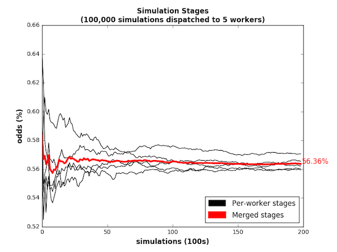
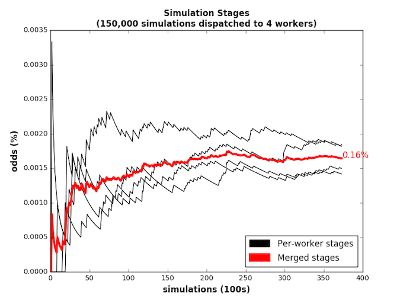
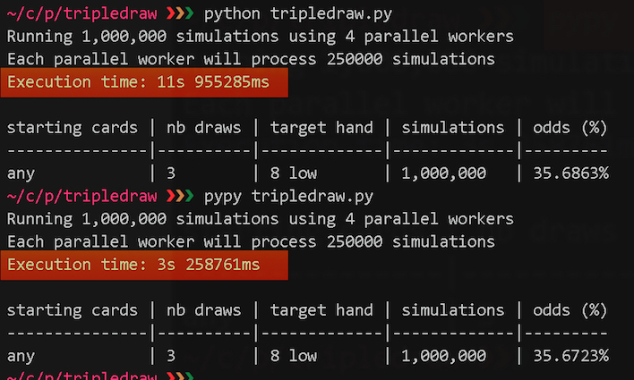

TripleDraw :dart:
================


**TripleDraw is a command line utility for studying card probabilities in the games of 2-7 Triple Draw And Single Draw (poker)**


### Before You Start

The main goal of this project was to build a Python app that uses some advanced Python programming techniques such as multiprocessing, decorators, lambdas and matplotlib charting while also learning more about poker and card probabilities.   It is 100% free to use, copy and modify however like any open source project no warranties are provided, see full [disclaimer](#disclaimer) at the end of this document.


### Introduction

TripleDraw lets you evaluate the odds of hitting a given target hand, say 8 low, from *pre-flop stage* to the *last draw* stage.

TripleDraw uses a technique called Monte Carlo simulations to estimate the probabilities of a given scenario.  It does that by  **simulating** large amounts of random draws, apply card playing rules and average out the results.  

As such it is important to note that TripleDraw is not a calculator but a *simulator*.  You can find more details about how those compare in the [Understanding TripleDraw's Results](#understanding-tripledraw-results) section.

### Installation


From your terminal window:

```
git clone git@github.com:jule64/TripleDraw.git

cd TripleDraw

pip install --editable .
```


The last step will install dependencies and create a `tripledraw` script which you can call from anywhere in your command line.

### Run a simulation

The below line will evaluate the odds of being dealt a *Jack low (or better) pre-flop*:

`tripledraw --starting-cards '' --draws 0 --target J`

This will print the result as follow  


```
starting cards | nb draws | target hand | simulations | odds (%) 
---------------|----------|-------------|-------------|----------
any            | 0        | J low       | 100,000      | 9.692667%   
```

Of course you can also study more advanced scenarios, such adding one, two or three draws and specify starting cards. **In fact setting the number of draws to 1 allows you to study the single draw variant of the game!**  

The help menu shows you how to run simulations in more details:  

`tripledraw --help`


### Charting

The `--plot` option takes snapshots of the simulation at various stages of the computation and renders these values in a time series chart.  This is interesting to see how the simulation converges to its final result.  

The black lines show the simulation values for each worker process and the red line shows the consolidated values.  The last data point on the red line is the simulation result and its value is highlighted in red in the chart.

**Odds of drawing to 9 Low after 3 draws:**  


  

**Odds of drawing to 7 Low pre flop:**  
The chart below shows the results of a *7 low preflop* scenario.  Since this is a rare hand to draw preflop we end up with this interesting 'saw'-shaped chart.  




### Performance

TripleDraw's performance will highly depend on the number of cores on your machine as well as the complexity of the scenarios being evaluated.  For example, 100,000 simulations should run in under 0.4 seconds in parallel mode (on 8 cores macbook).  1 million simulation will run in about 4 seconds under the same scenario.  However, in a three draws scenario, these performances drop to 1 seconds and about 8 seconds respectively. Note You can set the number of worker/cores to use by setting the `--procs` option.  

Additionally, you might want to try to run TripleDraw with **PyPy** (http://pypy.org/).  PyPy is an optimised Python interpreter that can significantly speed up your program without changing any of your code.  In our case, a large simulation will run over 4 times faster with PyPy vs CPython, it's very impressive:

**1 million simulations using PyPy vs CPython:**  
  
  
  

### System Requirements

TripleDraw should work on any version of **OSX** and **linux/ubuntu** with **python 2 or 3** installed.  
If you are on Windows the installation step might be a little different but it should still work once installed.


### Uninstall

`pip uninstall tripledraw`


### Understanding TripleDraw Results

The big advantage of using simulations is that it allows to evaluate complex scenarios without using complex maths, unlike you would using probabilistic calculations.
The flip side is that simulations contain some degree of imprecision compared to the actual probabilities of the evaluated scenarios.  Let's look at an example to illustrate this point and see how to minimize this problem with TripleDraw.


#### Example

Suppose you wanted to know the odds of being dealt a ***Jack low (or better) pre-flop***.  The mathematical approach gives this scenario a probability of *9.654%*(\*). TripleDraw by contrast gave values of *9.804%*, *9.66%* and *9.57%* in three separate runs using the default 50,000 simulations, roughly a 0.1% precision around the true value.  Since there is no real advantage in using odds beyond one decimal place in poker, the way one could read these results is to say *'the odds of being dealt a Jack low pre-flop are "about" 10%'*.  

If however you feel those results are too "wide", you can fix that by simply increasing the number of simulations.  To take our example again we re-ran the same scenario but this time using **1 million** simulations.  The results came back as: *9.653%*, virtually the same as the actual odds.

Precision however comes at the cost of longer running simulations, and it is up to you to balance out this constraint with your own requirements.  Note to change the default number of simulations use the `-n` option, for example `-n 500000` to run five hundred thousand simulations.


(\*)*By the way if you want to know how this number is calculated have a look in the `study` folder where I have added all the calculations step by step. Needless to say it's a lot of equations, and that's only for a simple pre-flop probability.  By contrast the simulations-style approach of TripleDraw means no complex maths are required :)*


### Finally


If you have any questions or suggestions please feel free to raise an issue or contact me at jule64(at)gmail(dot)com.

Contributions are welcome!


### DISCLAIMER
Copyright (c) 2016 by Julien Monnier and contributors.

THIS SOFTWARE AND DOCUMENTATION IS PROVIDED BY THE COPYRIGHT HOLDERS AND
CONTRIBUTORS "AS IS" AND ANY EXPRESS OR IMPLIED WARRANTIES, INCLUDING, BUT
NOT LIMITED TO, THE IMPLIED WARRANTIES OF MERCHANTABILITY AND FITNESS FOR
A PARTICULAR PURPOSE ARE DISCLAIMED. IN NO EVENT SHALL THE COPYRIGHT OWNER
OR CONTRIBUTORS BE LIABLE FOR ANY DIRECT, INDIRECT, INCIDENTAL, SPECIAL,
EXEMPLARY, OR CONSEQUENTIAL DAMAGES (INCLUDING, BUT NOT LIMITED TO,
PROCUREMENT OF SUBSTITUTE GOODS OR SERVICES; LOSS OF USE, DATA, OR
PROFITS; OR BUSINESS INTERRUPTION) HOWEVER CAUSED AND ON ANY THEORY OF
LIABILITY, WHETHER IN CONTRACT, STRICT LIABILITY, OR TORT (INCLUDING
NEGLIGENCE OR OTHERWISE) ARISING IN ANY WAY OUT OF THE USE OF THIS
SOFTWARE AND DOCUMENTATION, EVEN IF ADVISED OF THE POSSIBILITY OF SUCH
DAMAGE.